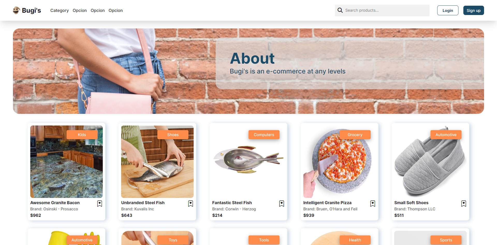
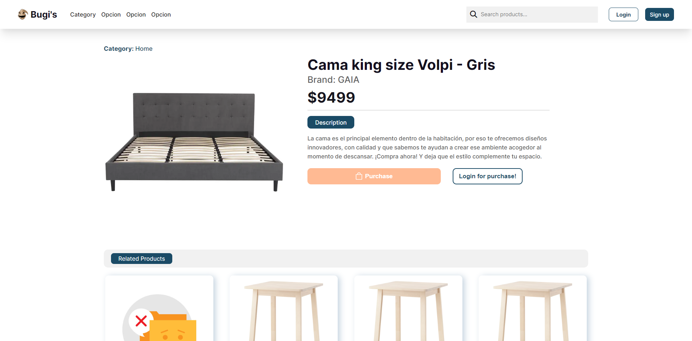
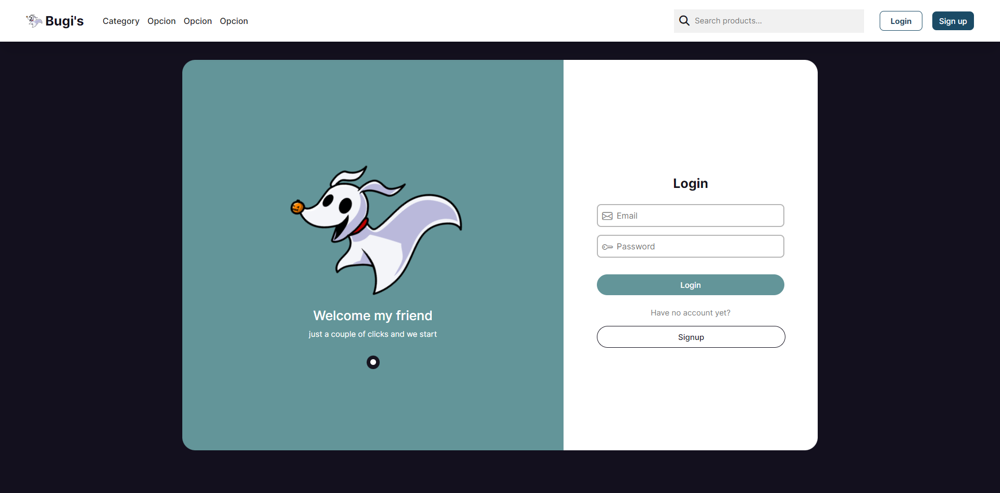
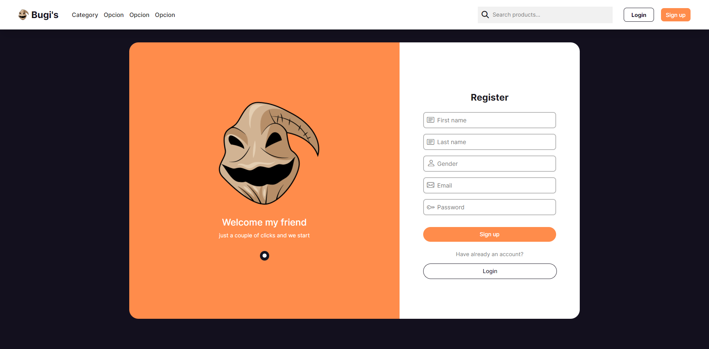
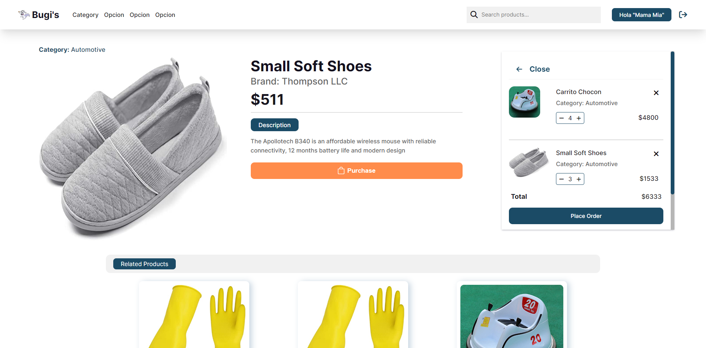
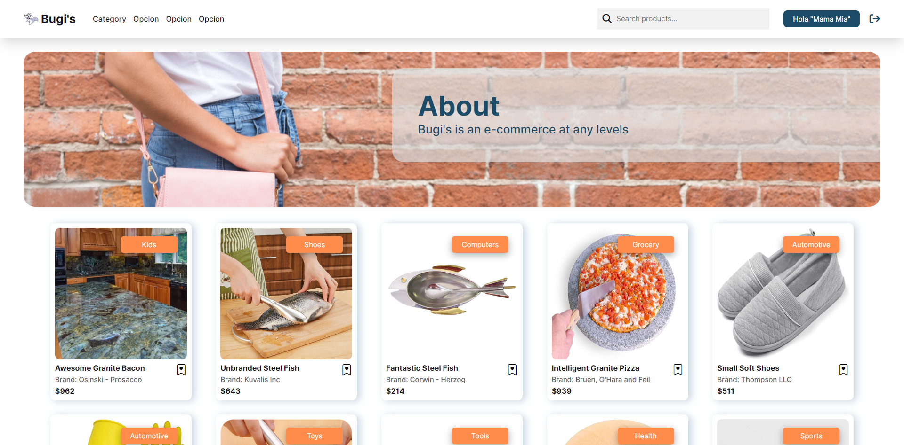
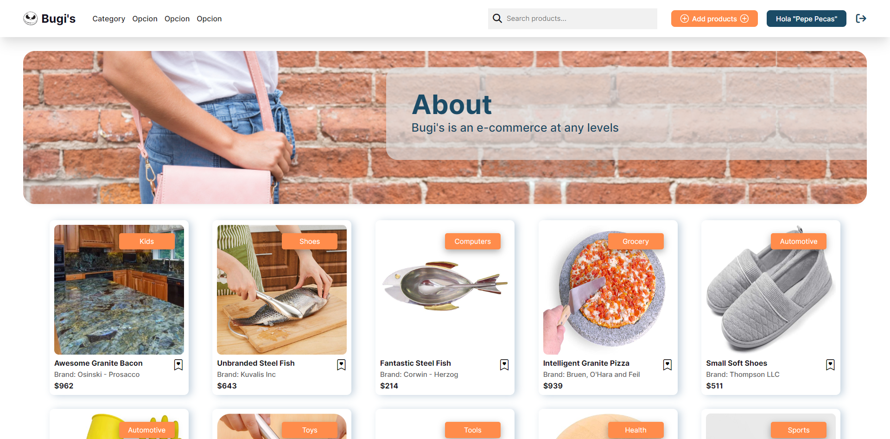
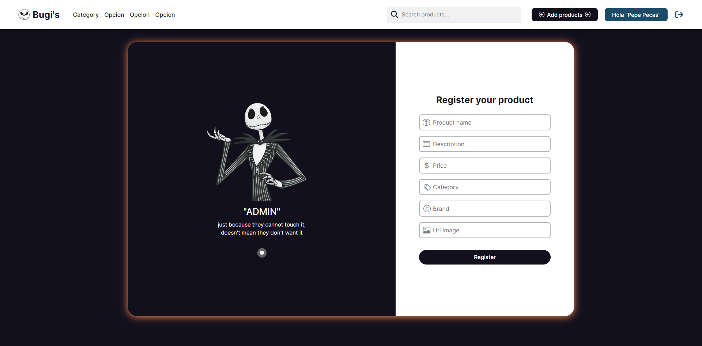

# Dev.f - React-e-Commerce 🎃🛒🎃

This is a solution to the project ✨ react-e-Commerce ✨ of the [Kata Frontend Avanzado](https://www.devf.la/master/encoding/mx).\
[Dev.f](https://www.devf.la/) offers an innovative solution to educational inclusion with EdTech programs that help people become software developers and obtain technological skills in order to obtain high-quality job opportunities in an agile and accessible way. 

## Table of contents

- [Overview](#overview)
  - [The challenge](#the-challenge)
  - [API](#api)
  - [How to interact (website)](#how-to-interact-with-the-website)
  - [Screenshot](#screenshot)
  - [Links](#links)
- [My process](#my-process)
  - [Built with](#built-with)
  - [Skills](#skills)
- [Author](#author)

## Overview

### The challenge

Build an e-commerce (electronic commerce site) with React from consuming an API of a provided generic backend.

### API

- [Documentation](https://documenter.getpostman.com/view/807695/Tzm6jvYY)
- [Endpoints summary](https://ecomerce-master.herokuapp.com/docs)

### How to interact with the website

*To have in mind* 
  - (The accounts have roles (**CUSTOMER & ADMIN**)).
  - By default they will have a "CUSTOMER" role.
  - If you want an "ADMIN" role in your account, you should create with Postman/Insomnia a user with the property: **"role": "ADMIN"** in the body.

1. With user / Without user:
  - When you enter to the home page you can see all the products.
  - In the NavBar the is a searcher bar to make searchs by products name.
  - By cliking on a specific card product, you are going to be redirected to an unic path, where all the product details are shown, and also a section with related products, filtered by category.

2. Without user (not logged in):
  - In the NavBar, at the right side are two buttons, which invites you to login or signup.
  - By cliking on the login button you will be redirected to the login form (with path: /login).
    - To have a succesful login you should already have a created account, if you don't have it there is a button to redirect you to the signup form.
    - When you logged succesfully to the page, your information will be saved to the localStorage, so when you enter again to the website you does not have to do it again (be aware that ocassionaly your session is going to expire, so you should click on the logout icon and login again | You will notice that because your user name does not appear correctly, just "...").
  - By cliking on the signup button you will be redirected to the signup form (with path: /signup).
    - To have a succesfull sigunp you should enter all the form fields, if not, the form will show an error until you do it correctly.
    - As a sign that your account has been succesfully created, you will be redirected to the login form (remember the entered email and password).
  - In the product details it is shown a purchase button, which is disable, that happens because you need to first login with an account to start your purchase, and that is why next to the purchase button there is another one, which invites you to login for purchase.
  - By clicking on the login purchase button, you will be redirected to the login form.

3. With an entered account (logged in) and "CUSTOMER" role:
  - In the NavBar, intead of show the login and signup buttons, the user name of the logged account will be there, and also an icon to logout of your account.
  - In the product details, there is shown a purchase button (enabled).
  - By cliking on the purchase button, in the right side of the website, there will be shown your shopping cart, where you can change the quantity of products, delete products, and place orders (they are going to be saved in your localStorage) (**In progress of making a page to consult all your products orders**).
  - The shopping cart has a close button, the total price of all your products (by quantity), and also a link to "Continue Shopping" wich redirects you to the home page.
  - In the product details page, if your shopping cart is not empty, there is going to be another button next to the purchase one, wich allows you to open you cart.

4. With an entered account (logged in) and "ADMIN" role:
  - All the CUSTMER functionalities.
  - In the NavBar, before the user name of the logged account there is another button, wich is for Add products.
  - By clicking on the add products button you will be redirected to a form to enter all the form fields for register your product (with path: /register/product).
    - To have a succesfull product register you should enter all the form fields, if not the form will show an error until you do it correctly.
    - When you had a succesfull register there will be shown a succes alert, and after a few seconds you will be redirected to the home page.

### Screenshot

1. Without user:
  - **Home Page**
  

  - **Product Detail page**
  
  
  - **Login Form**
  

  - **SignUp Form**
  

2. With user:
  - **Shopping Cart**
  

  - "CUSTOMER" role
    - **Home Page**
    

  - "ADMIN" role
    - **Home Page**
    

    - **Add products**
    

### Links

- GitHub Repository: [react-e-Commerce](https://github.com/Alelsito/react-e-Commerce)
- Live Site URL(Netlify): [react-bugis-e-commerce-netlify](https://react-bugis-e-commerce.netlify.app/)

## My process

### Built with

- HTML
- JS
- SASS (SCSS version)
- [BEM Methodology](https://getbem.com/) - Methodology to create reusable components (styles)
- [React](https://reactjs.org/) - JS library
- [Vite](https://vitejs.dev/) - Build frontend tool (in this case for React)
- [Google fonts](https://fonts.google.com/) - For fonts
- [Bootstrap icons](https://icons.getbootstrap.com/) - For icons
- [FontAwesome](https://fontawesome.com/) - For icons

### Skills

- APIs
- [Axios](https://axios-http.com/docs/intro)
- React library
- React Hooks:
    - [useState](https://reactjs.org/docs/hooks-state.html)
    - [useEffect](https://reactjs.org/docs/hooks-effect.html)
    - [useContext](https://reactjs.org/docs/hooks-reference.html#usecontext)
    - [Custom Hooks](https://reactjs.org/docs/hooks-custom.html)
- [React-Router-Dom](https://reactrouter.com/en/main)
    - [Navigate](https://reactrouter.com/en/main/components/navigate)
    - [Link](https://reactrouter.com/en/main/components/link)
    - [useNavigate](https://reactrouter.com/en/main/hooks/use-navigate)
    - [useLocation](https://reactrouter.com/en/main/hooks/use-location)
- [LocalStorage](https://developer.mozilla.org/es/docs/Web/API/Window/localStorage)
- [JWT Authentication](https://jwt.io/introduction)
- [NodeJS](https://nodejs.org/en/)
- [npm](https://www.npmjs.com/)
    - [jwt-decode](https://www.npmjs.com/package/jwt-decode)
- [StandardJs](https://standardjs.com/) - as linter
- Handling forms and events

## Author

- Github - [@Alelsito](https://github.com/Alelsito)
- LinkdIn - [Hugo Alejandro López Blanco](https://www.linkedin.com/in/hugolopezblanco/)
